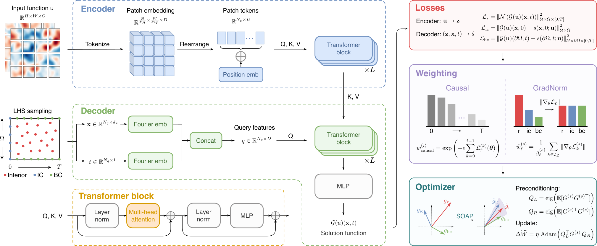
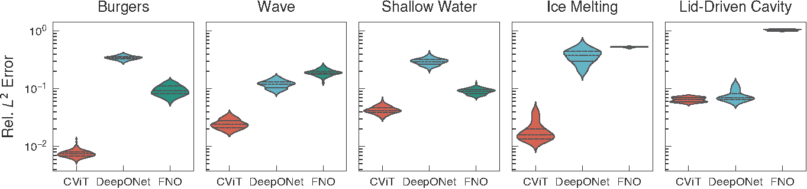
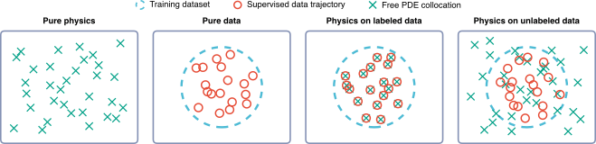
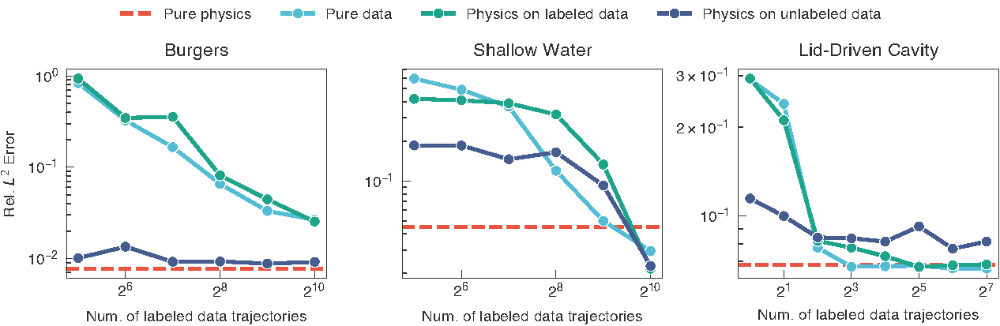

# PI-CViT

This repository contains the code for the paper "On training of physics-informed neural operator for solving parametric PDEs". 

## Overview




Error distribution of different models on each benchmark problem:


Model performance with different data regimes:



## Quick Start

Taking `Burgers' Equation` as an example, we provide the quick start guide for training `PI-CViT` on `Burgers' Equation`.

To generate the reference solution for `Burgers' Equation`, configure the parameters in `burgers/solver_jax.py` and run the following command in the top level directory of the repository:
```bash
python burgers/solver_jax.py
```

This will generate the reference solution and save it in `./data/burgers/`. Then train different models on `Burgers' Equation` with the following commands:
```bash
python -m burgers.train --configs train_cvit --set save_dir=<YOUR_LOG_DIR> --set data_dir=./data/burgers
python -m burgers.train --configs train_deeponet --set save_dir=<YOUR_LOG_DIR> --set data_dir=./data/burgers
python -m burgers.train_pifno --configs train_fno --set save_dir=<YOUR_LOG_DIR> --set data_dir=./data/burgers
```
For other configurations, please refer to `burgers/configs/`.