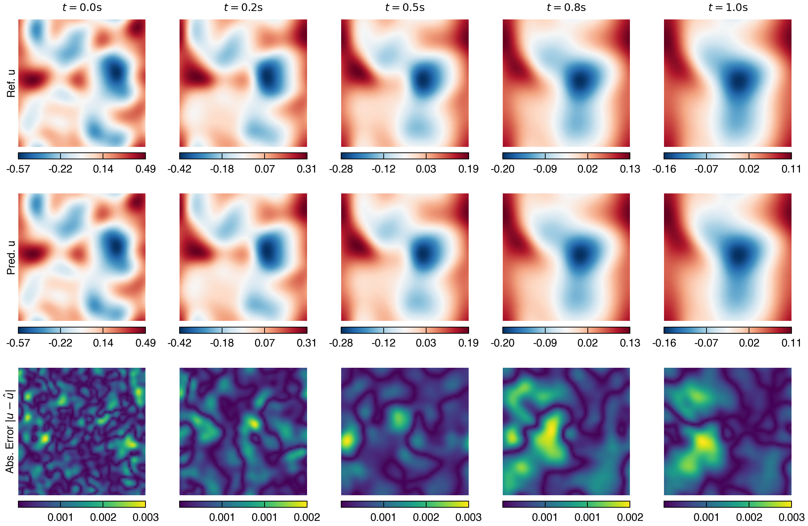
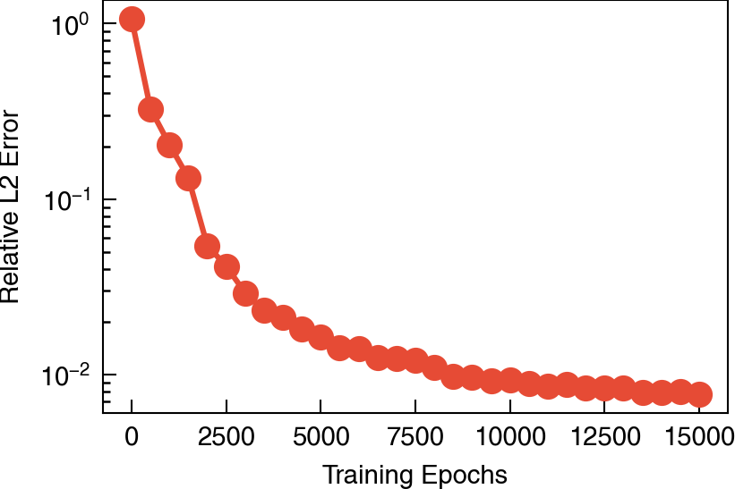

# Burgers Equation

## Problem Setup

We consider the 2D vector form of the Burgers equation:

```math
\mathbf{u}_t + (\mathbf{u} \cdot \nabla) \mathbf{u} = \nu \Delta \mathbf{u}
```
subject to periodic boundary conditions on the unit square domain $\Omega = [0, 1]^2$ and random initial conditions with characteristic length scale $\ell=0.1$.

## Results

Solution field at:



Test set relative L2 error convergence:

