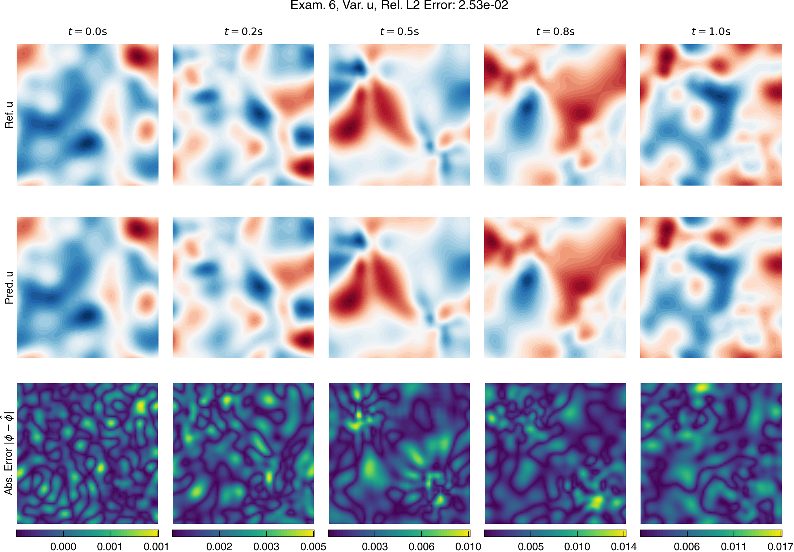

# Wave Equation 2D with Non-constant Velocity

We consider the 2D wave equation with a non-constant velocity field \(c(x,y)\):
$$
\frac{\partial^2 u}{\partial t^2} - c(x,y)^2 \left( \frac{\partial^2 u}{\partial x^2} + \frac{\partial^2 u}{\partial y^2} \right) = 0 \\
x, y \in [0, 1), \quad t \in [0, 1]
$$

\(u_0\) is random fields with length scale \(l = 0.1\).

\(c(x,y)\) is defined as:
$$
c(x,y) = 1 + 0.5 \sin(2 \pi x) \sin(2 \pi y)
$$

## Results

Solution field:

